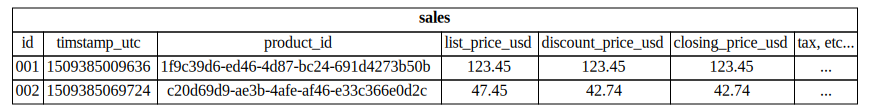
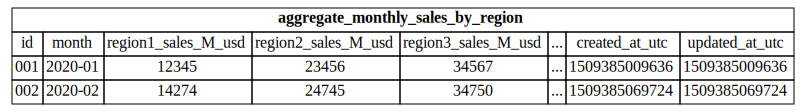

#
## An Example Problem

retail sales transactions

#
## Raw Data

A `sale` has:

    {
      "id": ...
      "timestamp_utc": ...
      "product_id": ...
      "list_price_usd": ...
      "discount_price_usd": ...
      "closing_price_usd": ...
      "tax": ...
      ...
    }

## Raw Data

- typically large dataset
- partitioned by time (depending on scale)
- additionally partitioned by:
    - region
    - product category
    - source (subsidiary)
    - ...

## Raw Data

##

    hdfs:///sales/
              -> year=2018/
                -> month=01/
                  -> day=01/
                    -> hour=00/
                      -> <datafile>.<format>

##

    hdfs:///sales/
              -> hour_utc=2018-01-01-00/
                -> <datafile>.<format>

##

    hdfs:///sales/
              -> region="west-coast"/
                -> hour_utc=2018-01-01-00/
                  -> <datafile>.<format>

#
## Aggregate Data

- total sales per timeperiod
- total sales per month by region
- total sales per month by region by category
- ...

##

    select sum(closing_price_usd)
      from sales
      where timestamp_utc >= '2018-01'
      and timestamp_utc < '2018-02';

##

    select month(timestamp_utc) as month,
           sum(closing_price_usd) as monthly_total
      from sales
      group by month
      order by month;

#
## What to do with _derived_ data?

recalculate it on-demand?

-vs-

precompute / "warehouse" it?

#
## Aggregate Tables

Store calculated aggregate values in tables

##

##

#
## Direct Queries

## Direct Queries

- pros:
    - fresh data
    - parametrizable (more flex for analysis)
    - full "chain-of-custody" for analysis
- cons:
    - computationally expensive (prohibitively so?)
    - complexity in organizing queries

#
## Store Aggregate Tables

## Store Aggregate Tables

- pros:
    - simple and relatively fast queries
    - superficially flexible queries (cube, pivot-table)
- cons:
    - stale data
    - unknown assumptions
    - hard to change
    - complexity in managing ETL

#
## is there a middle ground?

#
## More Info

- direct query
- views
- materialized views
- concepts in data warehousing
- caching
    - what is a cache?
    - query caching?

#

