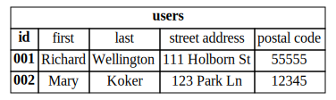

# What is a Relational Database?

##
- highly structured data store

(we'll compare to unstructure data stores)

##
- highly structured data store
- most common form of data storage

That's being replaced these days with NoSQL stores. But there's still valid reasons and uses for relational data stores

##
- highly structured data store
- most common form of data storage
- use Structured Query Language (SQL)

Users to access data and for administrators set up dbs. 
SQL in it's own right worth digging into. 
with Python, benefit as a data scientist, know SQL cold. 
Not just for RDBs.
A lot of the future of data science, a lot going on has been to make interacting with large datasets simple enough that it looks like old school sql.

# Entities

- User
- Product
- Address

The "things" you want to store
Represent as separate "tables" within a database
We'll use the terms relational data store and RDB, interchangeably for now

#
## Relational Database Table
## `users`

So you have a table with columns of different types your users, your customers. Each has an unique id, first and last name and an address and zip code.

## 

`select * from users;`

return all the users with all of their associated attributes, id, zipcode etc, from the table users. 

## 

`select * from users where id = '001';`

return the user 001 with all of his associated attributes.

#
## What's a Primary Key?
## `users`

A table typically has a primary key.
It's a column within the db that uniquely distinguishes every row.
Taylor won't do it
Usually, assign a number that generates an increase, eg by 1, every time you add a row. 
We've gone over what an RDB is and some basic features.

#

