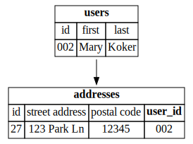
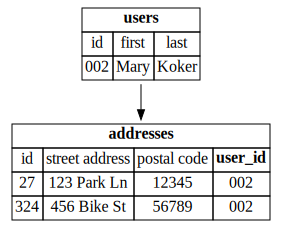

# Relations

"Things" can relate to other "things" in the database

# Entities

- User
- Product
- Address

#
## "has-one"

A User has a shipping address

## embed

embed the `address` inside of the `user` table

## relate

or _relate_ the `address` inside of the `user` table

We say "A User _has-one_ Address"

or equivalently "An Address _belongs-to_ one User"

We call `user_id` here a "Foreign Key"

#
## "has-many"

If a User can have _many_ Addresses...

## "has-many"

each `address` _belongs-to_ a single `user`

again, `user_id` is a "Foreign Key"

#
## "has-and-belongs-to-many"

A User purchases many Products

&

A Product can be purchased by many Users

## "has-and-belongs-to-many"

uses an association table

#

