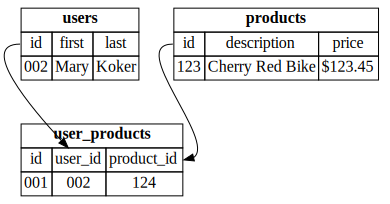
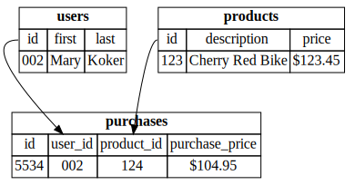
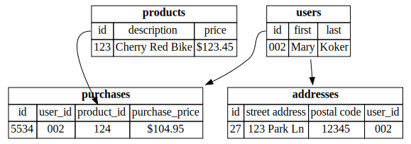
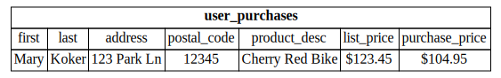

# Entities

- User
- Product
- Address

- So we'll set the scene again
- Talking about Entities, things stored in the data includ

#
## A User habtm Products

- We considered has and belongs to many relationships
- consider an association table such as `user_products`
- table that has a reference to the primary keys for the differnt tables for the entitites
- So, users has its own table with its own primary key
- products has its ownn table with its own primary key

#
## A User habtm Products

- Been looking at simplified.
- usually have information specific to that association, e.g., sales price
- perhaps Mary purchased the bike on sale
- usually have unique id for transaction

#
## Purchases

- Notice
- the product itself has a list price of X, but the actual buyer bought it perhaps on sale, for a lower price and that's in the `user_products` table
- of course we're leaving out a lot of stuff
- like dates/times

#
## Transactions

- Why do you go through all of this?
- This is a good format for the checkout software to update purchases.  
- It only has to update one table, `purchases`.
- Purchases are atomic "transactions" 
- and it can _roll_ back any errors.

#
## Schema

- This is what's called a database "Schema" or a "Data Model" for a relational database.
- we can see the tables associated with these entities and the relationships between them. 
- The arrows are those relationships
- We're not using some of the standard entitiy relationship diagrams here, because they get noisy

#
## Analytics?

- Now... do analytics off of this...
- Count the total purchases of bikes by zipcode it gets ugly...
- you're _joining_ a lot of tables just for a simple calculation
- This is a clasical problem in data sceince/engineering
- What you'd like to see, is the same information encoded in these transactions data
- you can see this easily in a report

#
## Reporting

- It's often much easier to report off of a "view" of the
database and not the raw transactional tables themselves
- Note that you often don't have full information (primary keys)
within the report.  This can cause problems in future analysis
- People get caught in the trap of creating all these fancy views for reporting systems, that answers only the questions it was designed to answer. 
- If you have a new question, you often have to do backflips to answer it from a reporting system. 

- This is changing drastically bt relational and non relational dbs

- This really is the concept of:

#
## Normalization

- two extreme representations of the same information

## Normalized

- Optimized for on-line transaction processing (OLTP)

## Denormalized

- Optimized for reporting and analysis
- sometimes your denorm views are viewsof the norm db, 
- sometimes they are a new reporting system, 
- an ETL (Extract, Transform and Load) process has pulled data from norm db to a new system.

- reality is often either a happy medium somewhere in-between,
or two totally separate databases for different purposes
and some sort of an ETL process to go between them.

#

