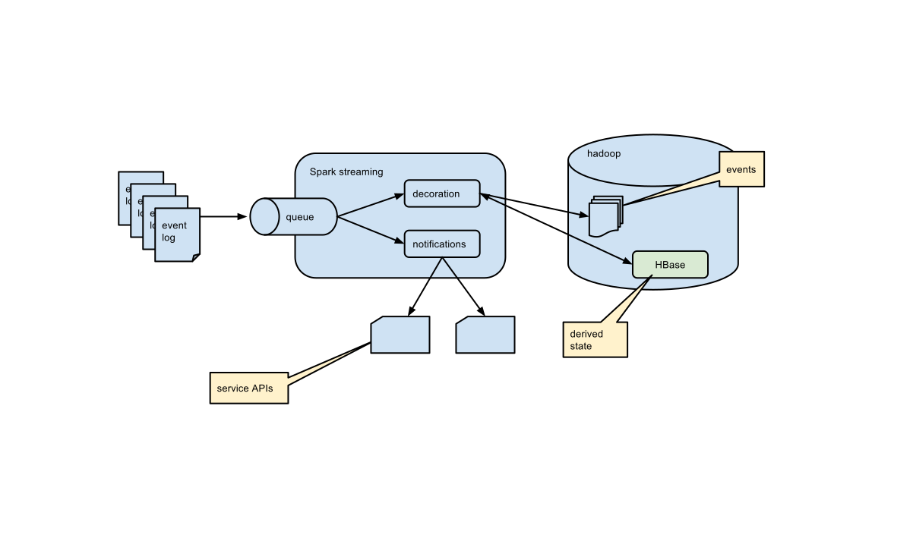

---
title: "Data Storage"
author: MIDS 205 - Fall 2017
...

---

# storing data

-first pass, sql & nosql, partioning I, hadoop, cloud

#
##

quick discussion, point at pipeline, we're doing storage

# 
## SQL

## NoSQL

# Cloud and Virtualization

intro to cloud
    virtualization
    round table: VMs to containers
    cluster computing, non commodity hardware, 
    fault tolerant

# Computing Models

distributed and parallel computing

blank slate about where data are from
what is a data store?

